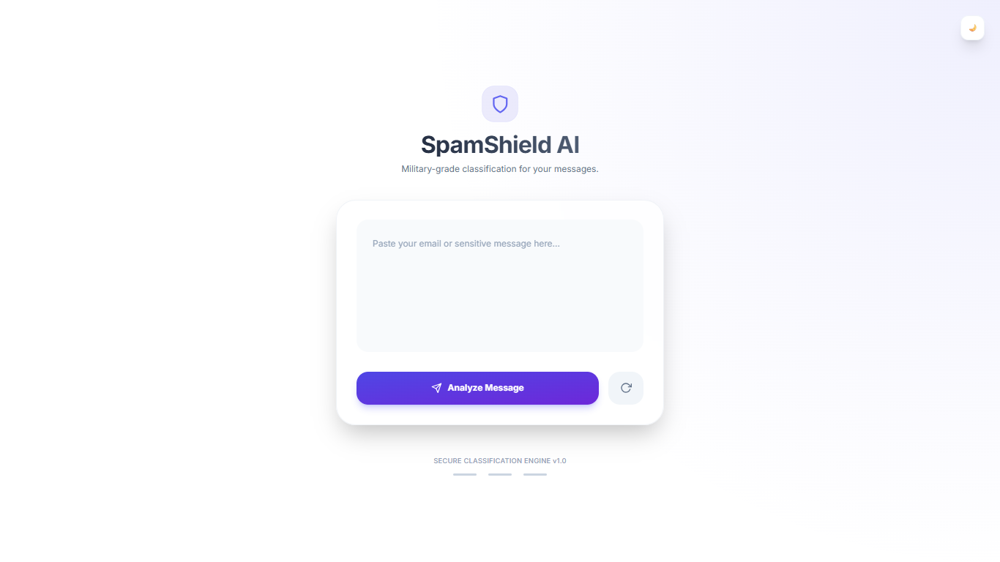
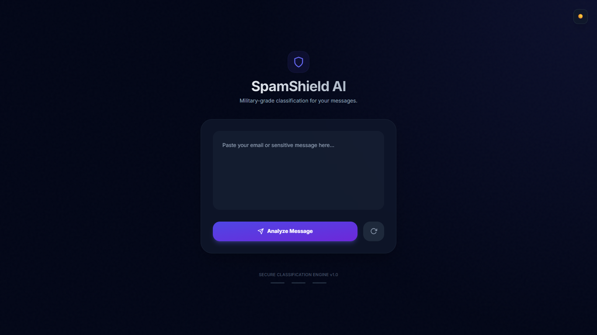
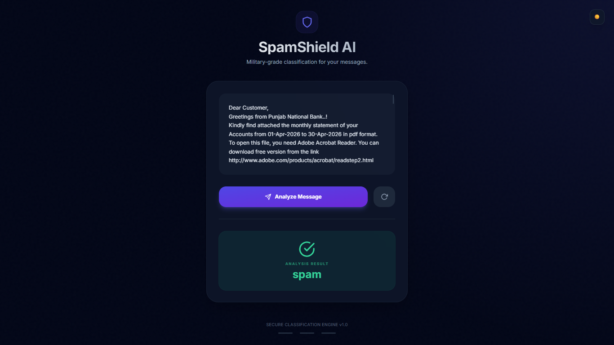
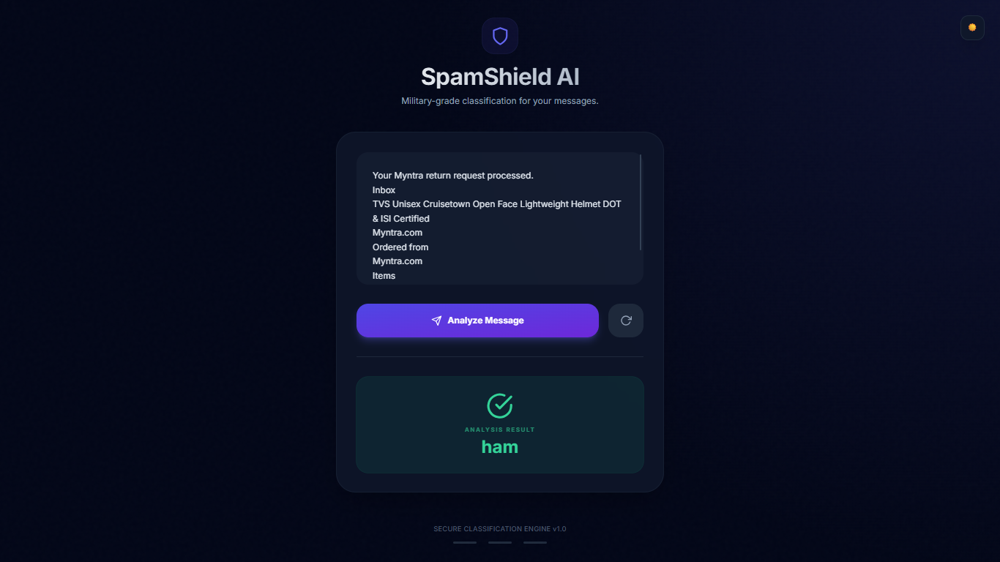

# 🚀 SpamShield AI — NLP Based Spam/Ham Classifier

An advanced NLP-based Spam Detection System built using **Python, Machine Learning, TF-IDF, Threshold Tuning, and Flask** with a modern futuristic UI inspired by AI applications.

---

# 📌 Project Overview

SpamShield AI classifies email/messages into:

- ✅ Ham (Safe Message)
- 🚨 Spam (Suspicious/Fraudulent Message)

This project focuses not only on prediction accuracy but also on:

- Precision & Recall optimization
- Threshold tuning
- False positive reduction
- Real-world spam detection behavior
- Professional AI-style UI

---

# 🧠 Workflow of the Project

## 1️⃣ Dataset Collection

- Used Spam/Ham dataset from Kaggle
- Performed analysis on real-world SMS/email messages

---

# 2️⃣ Text Preprocessing

Performed complete NLP preprocessing pipeline:

- Lowercasing
- Contractions handling
- Tokenization
- Stopword removal
- Lemmatization
- Punctuation removal

Libraries used:

```python
nltk
contractions
string
```

---

# 3️⃣ Feature Engineering

Used:

```python
TF-IDF Vectorization
```

to convert text into numerical features.

---

# 4️⃣ Model Training

Multiple Machine Learning models were trained and compared.

Examples:

- Logistic Regression
- Naive Bayes
- Random Forest
- SVM
- KNN

---

# 5️⃣ Model Evaluation

Compared models using:

- Accuracy
- Precision
- Recall
- F1-Score
- Confusion Matrix
- Precision-Recall Curve

Main focus was reducing false positives.

---

# 6️⃣ Hyperparameter Tuning

Performed tuning to improve model performance.

Optimized:

- Threshold values
- Precision/Recall balance
- Spam sensitivity

---

# 7️⃣ Threshold Tuning

Instead of using default threshold:

```python
0.5
```

custom threshold tuning was applied after analyzing:

- Precision Recall Curve
- Confusion Matrix
- Prediction probabilities

Final threshold improved real-world spam classification.

---

# 8️⃣ Final Model Selection

After comparing all models:

✅ Best performing model was selected  
✅ Exported as:

```python
best_model.pkl
```

Used later in Flask application.

---

# 🌐 Flask Web Application

The trained model was integrated with Flask.

Features:

- AI-style futuristic UI
- Dark/Light mode
- Real-time message analysis
- Spam/Ham result card
- Reset button
- Responsive design

---

# 🎨 UI Design

The UI was inspired by modern AI interfaces and customized further for this project.

Main improvements done:

- Futuristic glassmorphism effect
- AI-themed dark mode
- Clean result animations
- Professional user experience

---

# 📸 Screenshots

## 🌙 Dark Mode



---

## ☀️ Light Mode



---

## 🚨 Spam Detection Example



---

## ✅ Ham Detection Example



---

# 📂 Project Structure

```bash
Spam_Ham_NLP_Project/
│
├── static/
│   ├── style.css
│   └── script.js
│
├── templates/
│   └── index.html
│
├── app.py
├── best_model.pkl
├── requirements.txt
├── Spam_ham_2.ipynb
└── README.md
```

---

# 🛠️ Technologies Used

## Backend

- Python
- Flask

## Machine Learning

- Scikit-learn
- TF-IDF
- NLP

## Frontend

- HTML
- CSS
- JavaScript

## NLP Libraries

- NLTK
- contractions

---

# 📸 Screenshots

## 🌙 Dark Mode

- Modern AI Dashboard
- Spam/Ham analysis card
- Professional UI

## ☀️ Light Mode

- Clean minimal design
- Responsive layout

## 🚨 Spam Detection Example

- Fraud/spam email classified successfully

## ✅ Ham Detection Example

- Safe message classified correctly

---

# ⚙️ Installation

## Clone Repository

```bash
git clone https://github.com/Bhavesh950/Spam_Ham_Classifier_NLP_Project.git
```

---

## Install Dependencies

```bash
pip install -r requirements.txt
```

---

## Run Flask App

```bash
python app.py
```

---

# 📊 Future Improvements

- Email phishing detection
- Deep Learning models
- BERT/Transformers integration
- User authentication
- API deployment
- Live email scanning

---

# 👨‍💻 Author

## Bhavesh Mulchandani

Passionate about:

- Data Science
- Machine Learning
- NLP
- AI-based applications

---

# ⭐ Project Highlights

✅ End-to-End NLP Project  
✅ Real-world Spam Detection  
✅ Threshold Tuning  
✅ Precision/Recall Optimization  
✅ Flask Deployment  
✅ Professional AI UI  
✅ Complete ML Workflow Included  

---

# 🔥 Final Note

This project was built not just for accuracy, but to understand:

- how NLP pipelines work,
- how models behave in real-world scenarios,
- and how threshold tuning can improve practical spam detection systems.