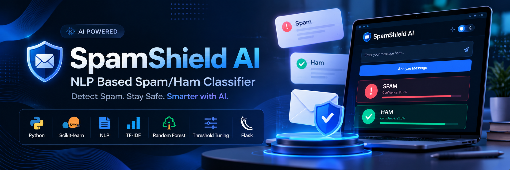
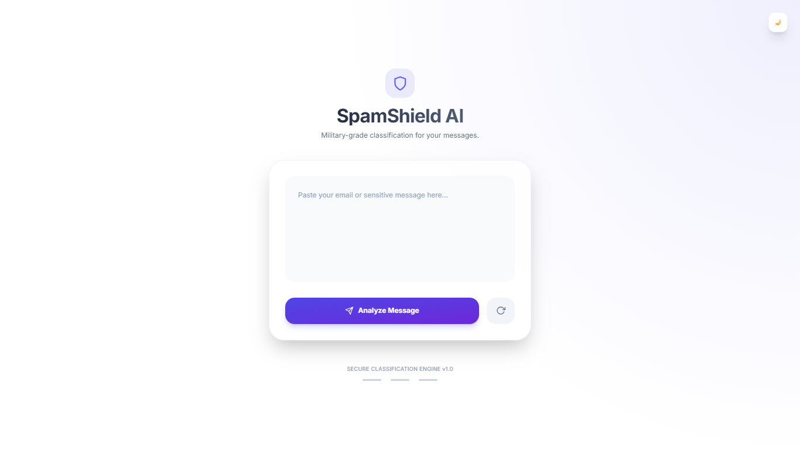
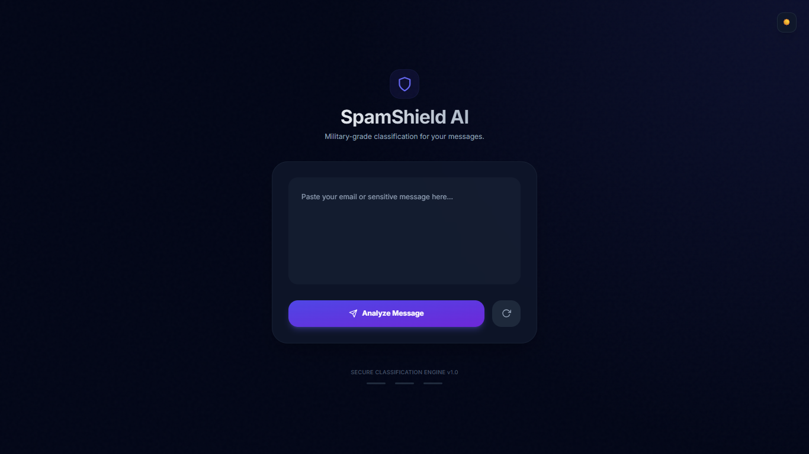
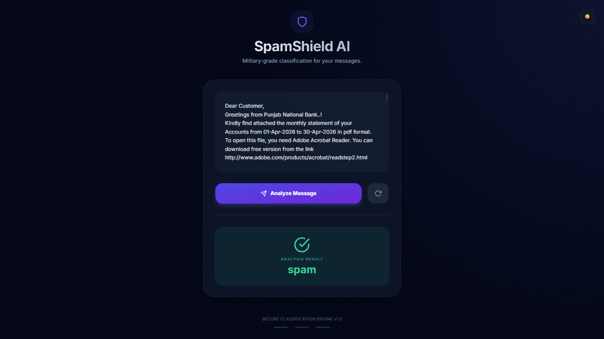
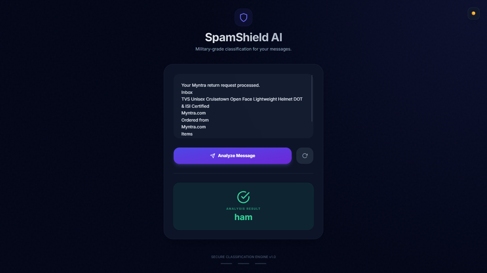

<p align="center">
  
</p>

# 🚀 SpamShield AI — NLP Based Spam/Ham Classifier

An advanced NLP-based Spam Detection System built using **Python, Machine Learning, TF-IDF, Random Forest, Threshold Tuning, and Flask** with a modern futuristic AI-inspired UI.

---

# 📌 Project Overview

**SpamShield AI** is an end-to-end Natural Language Processing and Machine Learning application designed to classify messages into:

- ✅ **Ham** — Safe / Legitimate Message
- 🚨 **Spam** — Suspicious / Unwanted Message

The project covers the complete machine learning workflow from **text preprocessing and feature engineering to model training, evaluation, threshold tuning, model serialization, and Flask integration**.

This project focuses not only on model prediction but also on:

- Precision & Recall analysis
- Threshold tuning
- False positive analysis
- Prediction probability
- Real-world spam detection behavior
- Machine learning model comparison
- Professional AI-style web interface

---

# 🧠 Project Workflow

The complete workflow of the project:

```text
Raw Message
     ↓
Text Preprocessing
     ↓
TF-IDF Feature Extraction
     ↓
Machine Learning Model
     ↓
Prediction Probability
     ↓
Custom Threshold
     ↓
Spam / Ham Classification
     ↓
Flask Web Application
```

---

# 1️⃣ Dataset Collection

A Spam/Ham dataset sourced from **Kaggle** was used for this project.

The dataset contains text messages belonging to two classes:

```text
Spam
Ham
```

The dataset was analyzed and prepared before applying the NLP preprocessing pipeline.

---

# 2️⃣ Text Preprocessing

Raw text data cannot be directly passed into a traditional machine learning model.

Therefore, a complete NLP preprocessing pipeline was implemented to clean and normalize the text.

### Preprocessing Steps

- Lowercasing
- Contractions handling
- Tokenization
- Stopword removal
- Lemmatization
- Punctuation removal

### Libraries Used

```python
nltk
contractions
string
```

The objective of preprocessing is to convert raw messages into clean and consistent text before feature extraction.

---

# 3️⃣ Feature Engineering

After preprocessing, the cleaned text was converted into numerical features using:

```python
TF-IDF Vectorization
```

### TF-IDF

**TF-IDF (Term Frequency-Inverse Document Frequency)** is used to represent the importance of words within the dataset.

The process can be represented as:

```text
Clean Text
    ↓
TF-IDF Vectorization
    ↓
Numerical Feature Matrix
    ↓
Machine Learning Model
```

TF-IDF allows traditional machine learning algorithms to work effectively with text data.

---

# 4️⃣ Model Training

Multiple Machine Learning algorithms were explored and compared during the project.

### Models Explored

- Logistic Regression
- Naive Bayes
- Random Forest
- Support Vector Machine (SVM)
- K-Nearest Neighbors (KNN)

The models were evaluated using multiple classification metrics before selecting the final model.

---

# 5️⃣ Model Evaluation

Different evaluation metrics were used to understand model performance.

### Evaluation Metrics

- Accuracy
- Precision
- Recall
- F1-Score
- Confusion Matrix
- Precision-Recall Curve

### Precision

Measures how many messages predicted as spam were actually spam.

### Recall

Measures how many actual spam messages were successfully detected.

### F1-Score

Provides a balance between Precision and Recall.

### Confusion Matrix

Used to analyze:

```text
True Positive
True Negative
False Positive
False Negative
```

### Precision-Recall Curve

Used to analyze model behavior across different classification thresholds.

The project gives special attention to the balance between **false positives and false negatives**.

---

# 6️⃣ Hyperparameter & Model Analysis

Different machine learning approaches were explored during the development process.

The analysis focused on:

- Model performance
- Prediction probabilities
- Precision
- Recall
- F1-Score
- Classification behavior
- Threshold selection

The objective was to select a model suitable for practical spam classification.

---

# 7️⃣ 🎯 Threshold Tuning

A key part of this project is **custom probability threshold tuning**.

Instead of relying only on a default classification threshold, prediction probabilities were analyzed and a custom threshold was applied.

```text
Prediction Probability
          ↓
     Custom Threshold
          ↓
    ┌─────┴─────┐
    ↓           ↓
≥ Threshold  < Threshold
    ↓           ↓
  SPAM         HAM
```

Threshold behavior was analyzed using:

- Prediction probabilities
- Precision-Recall Curve
- Confusion Matrix
- Classification results

This provides additional control over the sensitivity of the spam classifier.

---

# 8️⃣ Final Model Selection

After comparing the different machine learning approaches:

✅ Final model was selected  
✅ Trained model was serialized  
✅ Model was saved as:

```python
best_model.pkl
```

The saved model is later loaded by the Flask application for real-time predictions.

---

# 🌐 Flask Web Application

The trained machine learning model was integrated into a Flask-based web application.

## 🛡️ SpamShield AI

The application allows users to enter a message and receive a Spam/Ham classification through an interactive web interface.

### Application Flow

```text
User enters message
        ↓
Flask receives input
        ↓
Text preprocessing
        ↓
TF-IDF transformation
        ↓
Trained ML model
        ↓
Prediction probability
        ↓
Custom threshold
        ↓
Spam / Ham result
        ↓
Result displayed in UI
```

---

# ✨ Application Features

- 🧠 Real-time Spam/Ham classification
- 🎯 Custom threshold-based prediction
- 🌙 Dark Mode
- ☀️ Light Mode
- 🚨 Spam result card
- ✅ Ham result card
- 🔄 Reset functionality
- 📱 Responsive interface
- ⚡ Fast local prediction
- 🎨 AI-inspired futuristic UI

---

# 🎨 UI Design

The UI was inspired by modern AI applications and customized specifically for this project.

### Main UI Improvements

- Futuristic glassmorphism-inspired design
- AI-themed interface
- Dark / Light mode
- Interactive classification result cards
- Clean message input section
- Result animations
- Responsive layout
- Professional user experience

The frontend was developed using:

```text
HTML
CSS
JavaScript
```

---

# 📸 Screenshots

## 🌙 Dark Mode



---

## ☀️ Light Mode



---

## 🚨 Spam Detection Example



---

## ✅ Ham Detection Example



---

# 🎥 Project Demo

A project demonstration video showcases:

- Flask application startup
- SpamShield AI interface
- Message input
- Spam classification
- Ham classification
- Interactive UI
- Real-time prediction

> 🎬 Demo video can be added to this section.

---

# 📂 Project Structure

```bash
Spam_Ham_Classifier_NLP_Project/
│
├── static/
│   ├── style.css
│   └── script.js
│
├── templates/
│   └── index.html
│
├── screenshots/
│   ├── dark_mode.png
│   ├── light_mode.png
│   ├── spam_result.png
│   └── ham_result.png
│
├── app.py
├── best_model.pkl
├── requirements.txt
├── Spam_ham_2.ipynb
├── .gitattributes
├── .gitignore
└── README.md
```

---

# 🛠️ Technologies Used

## Programming Language

- Python

## Backend

- Flask

## Machine Learning

- Scikit-learn
- Random Forest
- TF-IDF
- Pickle

## NLP Libraries

- NLTK
- contractions

## Frontend

- HTML
- CSS
- JavaScript

## Development & Version Control

- Jupyter Notebook
- Git
- GitHub
- Git LFS

---

# ⚙️ Installation & Setup

Follow the steps below to run the project locally.

---

# 1️⃣ Clone Repository

Open your terminal / PowerShell and run:

```bash
git clone https://github.com/Bhavesh950/Spam_Ham_Classifier_NLP_Project.git
```

Move into the project directory:

```bash
cd Spam_Ham_Classifier_NLP_Project
```

---

# 2️⃣ Create Virtual Environment

Creating a virtual environment keeps project dependencies isolated.

### Windows

```bash
python -m venv venv
```

Activate the environment:

```bash
venv\Scripts\activate
```

After activation, you should see something similar to:

```text
(venv) C:\...\Spam_Ham_Classifier_NLP_Project>
```

---

# 3️⃣ Install Dependencies

Install all required dependencies:

```bash
pip install -r requirements.txt
```

The project uses dependencies for:

- Flask
- Scikit-learn
- NLTK
- NumPy
- Pandas
- contractions
- Gunicorn

---

# 4️⃣ Run the Flask Application

Start the Flask application:

```bash
python app.py
```

The application will run locally at:

```text
http://127.0.0.1:3500
```

You can also open:

```text
http://localhost:3500
```

---

# 🧪 Example Usage

After starting the Flask application, open the application in your browser.

---

## 🚨 Example — Spam Message

Enter a message such as:

```text
Congratulations! You have won a free prize. Click now to claim your reward.
```

Click:

```text
Analyze Message
```

The application will process the message and return a classification.

Example:

```text
🚨 SPAM
```

---

## ✅ Example — Ham Message

Enter:

```text
Hey, are we still meeting at 6 PM today?
```

Click:

```text
Analyze Message
```

Example result:

```text
✅ HAM
```

---

# 🗃️ Jupyter Notebook

The complete machine learning development workflow is included in:

```text
Spam_ham_2.ipynb
```

The notebook contains the development process including:

- Dataset analysis
- Text preprocessing
- Feature engineering
- Model training
- Model comparison
- Model evaluation
- Threshold analysis
- Final model selection

---

# 💾 Git LFS — Large Model File

The trained model:

```text
best_model.pkl
```

is maintained using **Git Large File Storage (Git LFS)** because of its large file size.

### Install Git LFS

If Git LFS is not installed:

```bash
git lfs install
```

Then clone the repository:

```bash
git clone https://github.com/Bhavesh950/Spam_Ham_Classifier_NLP_Project.git
```

Git LFS will retrieve the tracked model file when Git LFS is properly configured.

---

# 🔧 Troubleshooting

## ❌ Python command not found

Check your Python installation:

```bash
python --version
```

If Python is installed but the command is not recognized, make sure Python is added to the system PATH.

---

## ❌ Pip command not found

Try:

```bash
python -m pip install -r requirements.txt
```

---

## ❌ Virtual Environment Activation Error

If PowerShell blocks virtual environment activation, use Command Prompt:

```cmd
venv\Scripts\activate.bat
```

---

## ❌ Model File Not Found

Make sure the following file exists in the project root:

```text
best_model.pkl
```

If Git LFS is being used, run:

```bash
git lfs install
```

---

## ❌ Port 3500 Already in Use

If port `3500` is already being used by another application, stop the previous Flask process and run the application again.

---

# 📊 Project Highlights

| Area | Implementation |
|------|----------------|
| Programming | Python |
| NLP | NLTK |
| Feature Engineering | TF-IDF |
| Classification | Random Forest |
| Model Comparison | Multiple ML Algorithms |
| Evaluation | Accuracy, Precision, Recall, F1 |
| Analysis | Confusion Matrix, Precision-Recall |
| Optimization | Custom Threshold Tuning |
| Backend | Flask |
| Frontend | HTML, CSS, JavaScript |
| Model Storage | Pickle |
| Version Control | Git / GitHub |
| Large File Management | Git LFS |

---

# 🔄 End-to-End ML Pipeline

```text
Dataset
   ↓
Data Analysis
   ↓
Text Preprocessing
   ↓
TF-IDF Feature Engineering
   ↓
Model Training
   ↓
Model Comparison
   ↓
Model Evaluation
   ↓
Threshold Tuning
   ↓
Final Model Selection
   ↓
Model Serialization
   ↓
Flask Integration
   ↓
Interactive Web Application
```

---

# 📚 Key Learnings

Through this project, I worked on:

- Building an end-to-end NLP classification pipeline
- Cleaning and preprocessing real-world text data
- Converting text into numerical features using TF-IDF
- Comparing multiple machine learning algorithms
- Evaluating classification models using multiple metrics
- Understanding Precision and Recall trade-offs
- Working with prediction probabilities
- Implementing custom threshold logic
- Saving and loading trained machine learning models
- Integrating machine learning with Flask
- Building a user-facing ML application
- Managing large trained model files using Git LFS

---

# 🔮 Future Improvements

Potential future improvements include:

- 📧 Email phishing detection
- 🤖 Deep Learning-based classification
- 🧠 BERT / Transformer-based classification
- 🔌 REST API integration
- 👤 User authentication
- 📬 Live email scanning
- ☁️ Cloud deployment
- 📊 Model monitoring
- 🔄 Feedback-based model retraining
- 📈 Advanced analytics dashboard

---

# 👨‍💻 Author

## Bhavesh Mulchandani

**AI / Machine Learning / Python Developer**

Interested in building applications across:

- Artificial Intelligence
- Machine Learning
- NLP
- Generative AI
- Python

### 🔗 GitHub

https://github.com/Bhavesh950

---

# ⭐ Project Highlights

✅ End-to-End NLP Project  
✅ Real-World Spam Detection  
✅ TF-IDF Feature Engineering  
✅ Multiple ML Model Comparison  
✅ Random Forest Classification  
✅ Precision / Recall Analysis  
✅ Custom Threshold Tuning  
✅ Flask Web Application  
✅ Professional AI-Inspired UI  
✅ Git LFS Model Management  
✅ Complete ML Workflow Included  

---

# 🔥 Final Note

This project was built not just to train a spam classifier, but to understand how a complete machine learning solution moves from **raw text data to a user-facing application**.

The project combines:

```text
🧠 NLP
     +
🤖 Machine Learning
     +
🔤 TF-IDF
     +
🎯 Threshold Tuning
     +
🌐 Flask
     +
🎨 Interactive UI
```

to create **SpamShield AI — an end-to-end Spam/Ham classification system.**

---

<p align="center">
  ⭐ If you found this project useful, consider giving the repository a star!
</p>
